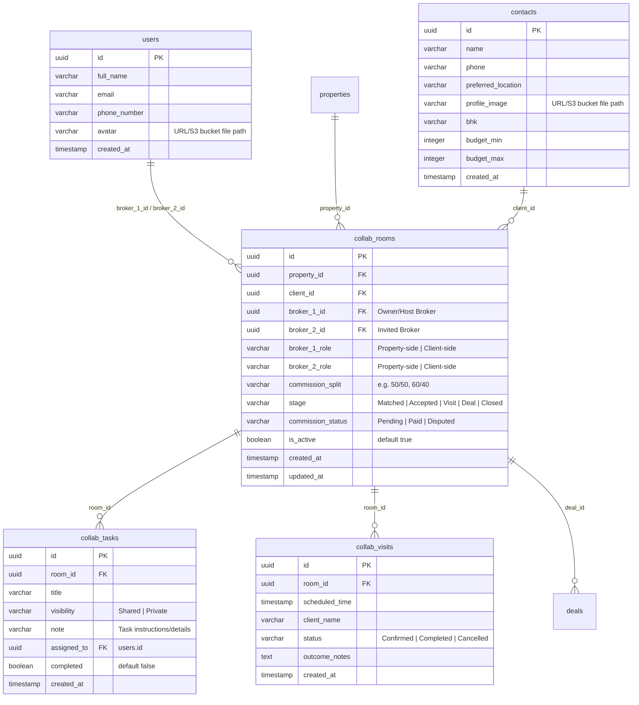

# Backend Collaboration Features: Requirements Specification

This document details the database schema additions, API endpoints, and server-side business logic required to migrate the frontend collaboration features to a persistent backend database.

---

## 1. Database Schema Additions

To support collaboration hubs, workspaces, checklist tasks, collaborative site visits, and commission splits, the following tables and relationships must be created in the PostgreSQL database.



---

## 2. API Endpoints Specification

### 2.1. Close Collaboration
Allows either broker participating in a shared workspace to close and deactivate the collaboration.

* **Route**: `POST /api/collab/rooms/:roomId/close`
* **Headers**: `Authorization: Bearer <token>`
* **Response**: `200 OK`
```json
{
  "success": true,
  "message": "Collaboration workspace closed successfully.",
  "data": {
    "roomId": "collab-room-uuid",
    "stage": "Closed",
    "is_active": false
  }
}
```

### 2.2. Start Deal & Auto-Deactivate Competitor Rooms
Triggered when a broker starts a deal from an active collaboration room.

* **Route**: `POST /api/collab/rooms/:roomId/start-deal`
* **Headers**: `Authorization: Bearer <token>`
* **Response**: `200 OK`
```json
{
  "success": true,
  "message": "Deal started. Competitor workspaces deactivated.",
  "data": {
    "dealId": "deal-uuid",
    "roomId": "collab-room-uuid",
    "stage": "Deal",
    "deactivatedRoomIds": [
      "other-collab-room-uuid-1",
      "other-collab-room-uuid-2"
    ]
  }
}
```
> [!IMPORTANT]
> **Server-Side Trigger / Logic:**
> When this endpoint is called, the backend must execute a transactional query:
> 1. Set the targeted `collab_rooms.stage = 'Deal'`.
> 2. Create a new entry in the `deals` table linking the client and property.
> 3. Automatically find all other active `collab_rooms` where `property_id = <this_property_id>` AND `client_id = <this_client_id>` (excluding this room ID).
> 4. Set those rooms to `is_active = false` and `stage = 'Closed'` (deactivating competitor proposals).

### 2.3. Settle Commission Split (Agreement Stage)
Provides a settlement endpoint to finalize and record commission payouts during the deal's Agreement stage.

* **Route**: `POST /api/collab/rooms/:roomId/settle-split`
* **Headers**: `Authorization: Bearer <token>`
* **Response**: `200 OK`
```json
{
  "success": true,
  "message": "Commission split settled and finalized.",
  "data": {
    "roomId": "collab-room-uuid",
    "commission_status": "Paid",
    "settled_at": "2026-08-07T00:00:00Z"
  }
}
```

---

## 3. Business Logic Requirements

### 3.1. Client & Follow-Up Task Tagging (Collaborated Badging)
* **Client Tagging**: 
  * When fetching clients from `GET /api/clients`, the backend must check active collaboration rooms (`collab_rooms`).
  * If a client is linked to an active workspace, the JSON response must include `"collaborated": true` and `"collaboration_room_id": "<uuid>"`, triggering the frontend to render the top-aligned purple `COLLABORATED DEAL` badge.
* **Follow-Up / Task Tagging**:
  * When fetching follow-ups or global CRM tasks (`GET /api/tasks` or `GET /api/followups`), the backend must join the task record to `collab_rooms` (by checking if the task is linked to a collaboration workspace room ID).
  * If associated with a collaboration, the task JSON payload must include `"collaborated": true`, prompting the frontend to render the purple `COLLABORATED` badge next to the task item in the dashboard's "Today's Focus" list and "Tasks" screen calendar lists.

### 3.2. Settle Button in Agreement Stage
* In the `/deal-page` (Agreement Stage), if the deal is flagged as a collaborated deal, the UI displays a **`Settle Commission Split`** button.
* Pressing this button invokes `POST /api/collab/rooms/:roomId/settle-split`, updating the commission status to `"Paid"` in the workspace.

### 2.4. Send Proposal / Collaboration Request
Initiates a proposal request from either property-side or client-side broker.

* **Route**: `POST /api/collab/requests`
* **Headers**: `Authorization: Bearer <token>`
* **Request Body**:
```json
{
  "property_id": "property-uuid",
  "client_id": "client-uuid",
  "role": "Property-side",
  "proposed_split": "50/50",
  "message": "Hi, I have a client interested in this property. Let's collaborate!"
}
```
* **Response**: `201 Created`

### 2.5. Counter or Accept Split Proposal
Allows updating split percentages, roles, or marking the proposal split as accepted to activate the workspace.

* **Route**: `PUT /api/collab/rooms/:roomId/split`
* **Headers**: `Authorization: Bearer <token>`
* **Request Body**:
```json
{
  "commission_split": "60/40",
  "status": "Countered" 
}
```
> [!NOTE]
> Setting `"status": "Accepted"` changes the room stage to `"Visit"`, launching the shared workspace checklist and messaging modules for both brokers.

### 2.6. Get Matching Properties (Matchmaking)
Queries properties that match a specific client's requirements.

* **Route**: `GET /api/collab/match/properties`
* **Query Params**: `client_id=<contact_uuid>`
* **Response**: `200 OK`
```json
{
  "success": true,
  "data": [
    {
      "id": "property-uuid",
      "name": "Property Owner/Broker Name",
      "compat": 85,
      "bhk": "3 BHK",
      "price": "₹1.25 Cr",
      "loc": "Vijay Nagar, Indore",
      "initial": "PO"
    }
  ]
}
```

### 2.7. Get Matching Clients (Matchmaking)
Queries clients whose requirements match a specific property listing.

* **Route**: `GET /api/collab/match/clients`
* **Query Params**: `property_id=<property_uuid>`
* **Response**: `200 OK`
```json
{
  "success": true,
  "data": [
    {
      "id": "client-uuid",
      "name": "Client Broker Name",
      "compat": 90,
      "bhk": "3 BHK",
      "price": "₹1.2 - ₹1.3 Cr",
      "loc": "Bandra, Mumbai",
      "initial": "CB"
    }
  ]
}
```

---

## 4. Extended Collaboration Logic Specs

### 4.1. Checklist Task Visibility (Shared vs. Private)
* **Rule**: When fetching tasks using `GET /api/collab/rooms/:roomId/tasks`, the backend must check the user ID from the authentication token:
  * Tasks marked as `visibility = 'Shared'` are returned to **both** participating brokers.
  * Tasks marked as `visibility = 'Private'` are **only** returned to the broker who created them (`assigned_to = broker_id`).

### 4.2. Dual-Broker CRM Calendar Sync
* **Rule**: When a site visit is logged via `POST /api/collab/rooms/:roomId/visits`, the backend must automatically register a pending follow-up task entry in the CRM task manager database for **both** broker accounts associated with that room (`broker_1_id` and `broker_2_id`).
* This ensures that both partners see the site visit in their **Tasks screen** and dashboard **Today's Focus** panel instantly.

### 4.3. Unlocking Client & Owner Details on Deal Stage
* **Rule**: When a collaboration room enters the `"Deal"` stage:
  * The backend must automatically set `unlocked.clientPhone = true` and `unlocked.ownerContact = true` in the room status registry.
  * Once the deal is initialized, contact details (phone, email, identity documents) for both the owner (property-side) and client (client-side) must be unlocked and made accessible to **both** participating brokers.
  * This permits both brokers to view critical client parameters on the shared Deal Page (`/deal-page`) to draft agreements and verify payment receipts.

### 4.4. Server-Side Matchmaking Algorithm Logic
* **Rule**: The backend matchmaking endpoints (`/api/collab/match/*`) must execute a calculation score to return percentage compatibility:
  * **BHK Match (Weight: 30%)**: Matches if property BHK configuration matches client requirements.
  * **Budget Match (Weight: 30%)**: Matches if property price is within client budget limits (`budget_min` to `budget_max`).
  * **Location Match (Weight: 20%)**: Matches using a case-insensitive string similarity search (such as PostgreSQL `ILIKE` or `tsvector` full-text search) comparing property location text to client's preferred location.
  * **Base Score (Weight: 20%)**: Added as default weight multiplier.

### 2.8. Get Active Collaboration Rooms
Returns list of active collaboration workspaces for the authenticated broker.

* **Route**: `GET /api/collab/rooms`
* **Headers**: `Authorization: Bearer <token>`
* **Response**: `200 OK`

### 2.9. Shared Checklist Task CRUD
* **Fetch Tasks**: `GET /api/collab/rooms/:roomId/tasks`
* **Create Task**: `POST /api/collab/rooms/:roomId/tasks`
  * Body: `{"title": "Verify blueprint", "visibility": "Shared"}`
* **Update Task State**: `PUT /api/collab/rooms/:roomId/tasks/:taskId`
  * Body: `{"completed": true}`
* **Delete Task**: `DELETE /api/collab/rooms/:roomId/tasks/:taskId`

### 2.10. Shared Site Visits Scheduling
* **Fetch Visits**: `GET /api/collab/rooms/:roomId/visits`
* **Schedule Visit**: `POST /api/collab/rooms/:roomId/visits`
  * Body: `{"scheduled_time": "2026-08-08T11:00:00Z", "client_name": "Arin Jain"}`
* **Reschedule/Feedback**: `PUT /api/collab/rooms/:roomId/visits/:visitId`
  * Body: `{"status": "Completed", "outcome_notes": "Client requested price split counters"}`

### 2.11. Update Broker User Profile Image
Saves the user's custom avatar image path to the database.

* **Route**: `PUT /api/profile`
* **Headers**: `Authorization: Bearer <token>`
* **Request Body**:
```json
{
  "avatar": "picked-profile-photo-url-or-base64"
}
```
* **Response**: `200 OK`
```json
{
  "success": true,
  "message": "Profile updated successfully.",
  "data": {
    "avatar": "picked-profile-photo-url-or-base64"
  }
}
```

### 2.12. Update Customer / Client Profile Photo
Updates the profile photo for a client lead in the database.

* **Route**: `PUT /api/clients/:id`
* **Headers**: `Authorization: Bearer <token>`
* **Request Body**:
```json
{
  "profile_image": "picked-profile-photo-url-or-base64"
}
```
* **Response**: `200 OK`
```json
{
  "success": true,
  "message": "Client details updated successfully.",
  "data": {
    "id": "client-uuid",
    "profile_image": "picked-profile-photo-url-or-base64"
  }
}
```
